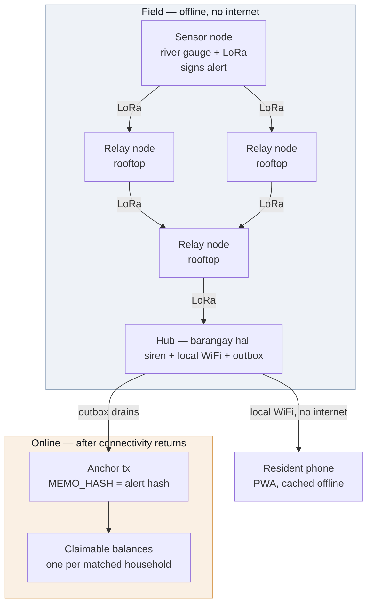

# LIGTAS — Product Requirements Document

*LoRa-Integrated Grassroots Typhoon Alert System*

Track: Climate Resilience and Hydrometeorological Disaster Management
Stage 3 · Forge
Version 0.5

This document is the system design for the concept set out in [README.md](README.md). The README states the problem and the pitch; this document states what gets built, how the pieces fit, and what "done" means at each stage.

---

## 1. Summary

LIGTAS is a barangay-scale flood warning network of about five solar-powered LoRa radio nodes. When a river crosses a threshold, a sensor node signs an alert packet and broadcasts it; relay nodes verify the signature offline and rebroadcast it; a hub at the barangay hall sounds a siren and serves purok-specific evacuation instructions over its own WiFi with no internet involved. When connectivity returns, the hub anchors each alert's hash to Stellar as a tamper-evident record and releases pre-funded parametric payouts to registered households in the affected puroks.

The siren covers the barangay by sound, but the phone-level instruction screen does not: the hub's WiFi reaches only 50–100 m, so only residents within that radius of a hub can pull up their purok-specific page. This is a hard ceiling on phone reach, not a software gap — a spread-out barangay needs multiple hubs to close it (see [Cost](README.md#cost) and [Known limitations](README.md#known-limitations) in the README).

The design principle that governs every decision below: **warning delivery must work with zero connectivity, and nothing on the warning path may depend on the network.** Blockchain is the receipt book and the payment rail, never the delivery channel.

---

## 2. Goals and non-goals

### Goals

| # | Goal | Measured by |
|---|---|---|
| G1 | Deliver a signed alert across a multi-hop mesh with no internet | Alert reaches hub through ≥5 hops in simulation, end to end |
| G2 | Reject forged and replayed alerts before they're acted on | Forged packet and replayed packet both reach the hub over the mesh but are rejected there, never triggering the siren or an anchor |
| G3 | Survive node failure without losing the alert | Alert still reaches hub after a relay node is killed mid-run |
| G4 | Show a resident the instruction for *their* purok, offline | PWA loads from cache with the device in airplane mode |
| G5 | Produce a tamper-evident public record of every alert | Alert hash visible on Stellar Expert, matches locally recomputed hash |
| G6 | Release a parametric payout without human adjudication | Claimable balance created for a registered account, no manual step |

### Non-goals

Explicitly out of scope for this hackathon. Named here so scope creep is visible when it happens.

- Multi-barangay federation or inter-barangay alert routing
- Native mobile application (the PWA is the only client)
- PAGASA or any external weather API integration
- LGU enrollment workflow or registry administration UI
- Soroban smart contracts, or any Rust component
- Physical hardware procurement, assembly, or field RF testing
- Mainnet deployment
- Turn-by-turn navigation, live traffic, or real-time flood conditions in the resident app's map (§8 shows a fixed offline snapshot and a demo flood model, and says so)

---

## 3. Users

| User | Context | What they need |
|---|---|---|
| **Resident** | Storm conditions, phone possibly offline, possibly no signal for days | A siren they can hear, and one screen *on their own phone* telling them where to go from *their* purok |
| **Barangay captain / authorised issuer** | Holds the signing key; legally accountable for warnings | Confidence that only they can issue an alert, and a record proving they did |
| **Hub operator (BDRRMC staff)** | Operates the hall node before and during an event | Alerts queue reliably and drain when the line comes back, with no data loss |
| **Auditor / LGU / COA** | Post-event, possibly adversarial | An independent record of what was issued and when, and where the money went |

---

## 4. System architecture



### Layer responsibilities

**L1 — Sensor node.** Reads water level, detects threshold crossing, builds and signs the alert packet, transmits. Debounces so a fluctuating reading does not emit a burst of alerts. Simulated in Wokwi (ESP32, Arduino C++).

**L2 — Relay nodes.** Verify signature offline against a cached authorised-issuer list, apply replay and duplicate rules, rebroadcast if the packet is new and valid. No state beyond the per-issuer sequence table and a short-lived seen-hash set. Simulated in Meshtasticator.

**L3 — Hub.** Verifies independently (does not trust that relays verified), fires the siren, updates the locally served PWA payload, and writes the alert to the SQLite outbox. Node + Express + `better-sqlite3`.

**L4 — Reconnection.** A drain worker anchors queued alerts to Stellar and creates claimable balances for matching households. Idempotent and safe to interrupt.

**L5 — Registry.** Off-chain, populated before any disaster: household ID → purok → Stellar address. Lives in the hub's SQLite database.

---

## 5. Alert packet specification

The alert is the core artifact of the entire system. It must be small enough for a LoRa payload, verifiable with no network, and stable enough to hash into a permanent record.

### 5.1 Wire format

A packet is a 20-byte signed body followed by a 64-byte Ed25519 signature — **84 bytes total**, comfortably inside Meshtastic's payload limit.

| Offset | Size | Field | Type | Notes |
|---|---|---|---|---|
| 0 | 1 | `version` | uint8 | `1` for this spec |
| 1 | 1 | `hazard` | uint8 | `1` river flood, `2` flash flood, `3` storm surge, `0` test |
| 2 | 1 | `severity` | uint8 | Tier `1`–`3` |
| 3 | 1 | `issuerIndex` | uint8 | Index into the cached authorised-issuer list |
| 4 | 4 | `purokBitmap` | uint32 BE | Bit *n* set = purok *n+1* affected; supports 32 puroks |
| 8 | 4 | `issuedAt` | uint32 BE | Unix seconds |
| 12 | 4 | `sequence` | uint32 BE | Per-issuer, strictly increasing |
| 16 | 2 | `waterLevelCm` | uint16 BE | Reading that triggered the alert; evidence, not a trigger input |
| 18 | 2 | `reserved` | uint16 BE | Zero; reserved for future fields |
| 20 | 64 | `signature` | bytes | Ed25519 over bytes `[0, 20)` |

Encoded and decoded with `DataView` in `packages/core`, big-endian throughout, no JSON and no schema library on the wire.

`issuerIndex` rather than a full 32-byte public key: the authorised-issuer list is provisioned to every node before deployment, so one byte identifies the signer and saves 31 bytes of airtime. The trade-off is that a node with a stale list cannot verify a newly added issuer — accepted, since issuer changes are rare and provisioned deliberately. **Open question:** whether to also carry a 4-byte key-fingerprint hint so a stale node can at least log *which* unknown issuer it rejected.

### 5.2 Alert identity

```
alertHash = SHA-256( body[0..20) )
```

32 bytes, which is exactly the size of a Stellar `MEMO_HASH`. The same hash is the outbox primary key, the deduplication key in the mesh, and the on-chain anchor value. One identifier throughout the system, derivable offline by anyone holding the packet.

### 5.3 Signing and verification

Per the project's key design rule, Stellar keypairs *are* the alert identity — there is no separate PKI.

- Sign: `Keypair.signMessage(body)` from `@stellar/stellar-sdk/base` (SEP-53)
- Verify: `Keypair.fromPublicKey(issuerPubkey).verifyMessage(body, signature)`

`packages/core` imports only the `/base` subpath. It must never import Horizon or any RPC client — a network import in this package would break the offline threat model, and the rule is enforced by review and by a dependency check in CI.

### 5.4 Replay, duplicate, and staleness rules

A multi-hop mesh means the *same* alert legitimately arrives several times by different paths. Duplicate suppression and replay defence are therefore separate mechanisms, and conflating them would either break propagation or open a replay hole.

**Where this logic runs — a correction from v0.1.** The table below describes what a *verifying endpoint* does on receiving a packet: the hub, the PWA, and `mesh-sim`'s test observer. It does not run on the LoRa relay nodes themselves. Those are stock Meshtastic firmware — they flood-forward every packet within its hop limit regardless of content, because they have no way to parse a custom payload and decide whether to suppress it. A forged or replayed packet propagates through the mesh exactly like a genuine one; what stops it is that nothing acts on it once it arrives. See §5.5 and §9.

Each verifying endpoint keeps two pieces of state, per issuer it tracks:

1. `lastSeq[issuerIndex]` — highest sequence number accepted from that issuer
2. `seenHashes` — set of `alertHash` values seen recently, with a TTL

On receiving a packet:

| Condition | Action |
|---|---|
| Signature invalid | Reject, count as `rejected_signature` — the packet is not acted on |
| `issuerIndex` not in cached list | Reject, count as `rejected_unknown_issuer` |
| `alertHash` in `seenHashes` | Ignore silently — normal mesh duplicate, not an attack |
| `sequence` < `lastSeq[issuer]` | Reject, count as `rejected_replay` |
| `sequence` ≥ `lastSeq[issuer]`, hash unseen | **Accept**: act on it (fire siren / show instruction / log), add hash to `seenHashes`, set `lastSeq` |

Clock trust is deliberately excluded from the accept decision. Field nodes have no NTP and will drift; `issuedAt` is recorded and anchored as the issuer's claim of time, but a node never rejects a packet for a timestamp it cannot independently verify. Sequence number is the sole ordering defence. **Open question:** whether the hub — which does eventually see real time — should flag alerts whose `issuedAt` diverges wildly from their arrival time, as a monitoring signal rather than a drop rule.

### 5.5 Carriage over the mesh

The 84-byte packet is opaque payload as far as Meshtastic is concerned. It rides as the data payload of a Meshtastic packet on a private app port (256), broadcast to the mesh — nothing is JSON-wrapped, base64'd, or otherwise re-encoded in transit. Relays forward it unparsed, exactly as received; what a verifying endpoint checks is byte-for-byte what the sensor signed, which is what makes the signature meaningful despite passing through firmware that has no idea what it's carrying.

**The mesh has no application logic — a correction from v0.1.** Each simulated node runs stock `meshtasticd`; it floods every packet within hop limit regardless of payload, because it cannot parse our format. Propagation between nodes isn't even native radio simulation inside one process: each `meshtasticd` instance streams its outgoing transmissions, wrapped in Meshtastic's own `SIMULATOR_APP` envelope, back over its TCP connection to Meshtasticator's orchestrator process, which computes range from node positions and antenna gain and re-injects the packet into whichever other nodes' `meshtasticd` instances are in reach. That orchestrator — not a piece of our code — *is* the simulated radio medium. Confirmed directly: connecting a bare TCP client to a node's port and sending data with no orchestrator attached produces no propagation at all: the transmission has nowhere to go. See §9 for what this means for the threat model.

`packages/mesh-sim` therefore doesn't reimplement propagation; it drives Meshtasticator's own orchestrator (`InteractiveSim`, run via its `-s` script mode rather than its interactive `(Cmd)` prompt, which needs a live terminal and can't be scripted). It connects to the sensor node's port to inject a signed packet, connects to other nodes' ports to observe arrival, and uses `docker exec` to kill a relay's `meshtasticd` process mid-run for the rerouting test. Node ports are `4404 + nodeId`.

**Language boundary — deliberate.** `mesh-sim` is Python, not Node, which is the one place this project departs from being a TypeScript monorepo. Two reasons. First, the mature Meshtastic client library is Python and is already proven against our simulator — it's what Meshtasticator itself is built on. The JavaScript equivalent is a pre-1.0 package that has not been updated in close to a year. Second, and decisively, the Meshtastic client libraries are GPL-3.0-only. Importing one into this MIT-licensed codebase would force the whole project to GPL. Running Meshtasticator and a Python driver as *separate programs* keeps that boundary clean — the same boundary Meshtasticator itself relies on. `packages/core` emits the 84 bytes; the Python driver moves them; no GPL code is ever linked into ours.

---

## 6. Hub

### 6.1 Outbox schema

```sql
CREATE TABLE alerts (
  alert_hash     TEXT PRIMARY KEY,   -- hex SHA-256 of the signed body
  body           BLOB NOT NULL,      -- 20 bytes, verbatim
  signature      BLOB NOT NULL,      -- 64 bytes
  issuer_pubkey  TEXT NOT NULL,      -- G... address, resolved from issuerIndex
  sequence       INTEGER NOT NULL,
  hazard         INTEGER NOT NULL,
  severity       INTEGER NOT NULL,
  purok_bitmap   INTEGER NOT NULL,
  issued_at      INTEGER NOT NULL,   -- from packet
  received_at    INTEGER NOT NULL,   -- hub local clock
  anchor_status  TEXT NOT NULL DEFAULT 'pending',  -- pending|submitted|confirmed|failed
  anchor_tx      TEXT,
  payout_status  TEXT NOT NULL DEFAULT 'none',     -- none|pending|created|failed
  attempts       INTEGER NOT NULL DEFAULT 0,
  last_error     TEXT
);

CREATE TABLE households (
  household_id   TEXT PRIMARY KEY,
  purok          INTEGER NOT NULL,
  stellar_address TEXT NOT NULL
);
```

The raw `body` and `signature` are stored verbatim rather than only their parsed fields, so the hash and the signature remain independently re-verifiable years later from the database alone.

### 6.2 Drain worker

Runs whenever connectivity is present. For each alert with `anchor_status = 'pending'`, in `received_at` order:

1. Submit the anchor transaction; set `anchor_status = 'submitted'` with the tx hash recorded **before** awaiting confirmation, so an interrupted run can be reconciled rather than resubmitted blindly
2. On confirmation, set `anchor_status = 'confirmed'`
3. If severity meets the payout threshold, create claimable balances for matching households, then set `payout_status = 'created'`
4. On failure, increment `attempts`, record `last_error`, retry with exponential backoff

Interruption is expected, not exceptional — the whole point of the outbox is that the line drops. Every step is keyed on `alert_hash` and re-entrant.

---

## 7. Stellar layer

Stellar Classic only. No Soroban, no Rust.

**Anchoring.** A minimal payment from the hub account to itself carrying `MEMO_HASH = alertHash`. The 32-byte memo field takes the alert hash exactly, with no encoding loss. Cost is a fraction of a cent, and the resulting transaction is a permanent timestamped record that no party to a later dispute controls.

**Payout.** One `createClaimableBalance` operation per matched household account, with a flat amount determined by severity tier. Claimant predicate is unconditional for the household, with a reclaim predicate for the barangay account after a set window so unclaimed funds are recoverable. **Open question:** the length of that window.

**Idempotency.** Re-running the drain must never double-pay. Before creating balances, the worker checks `payout_status` and, where uncertain, queries existing claimable balances for the sponsoring account. This is the highest-risk correctness surface in the system and gets dedicated tests.

**Network.** Testnet throughout, funded by Friendbot. Proof screenshots come from Stellar Expert.

---

## 8. PWA

React + Vite + Tailwind + `vite-plugin-pwa`, with `idb` for cached alerts.

- Served by the hub over its own WiFi with no internet on that network
- Service worker caches the shell and the evacuation instruction set on first visit, so the page still opens after the resident walks out of WiFi range
- Resident selects their purok once; the selection persists locally
- On receiving an alert, the app shows the instruction for that resident's purok only if their bit is set in `purokBitmap` — otherwise it shows an explicit "your purok is not affected" state rather than an empty screen
- Cached alerts are listed newest first, each showing issued time and severity

**Resident experience (added in v0.5).** The bullets above are the original Version 0 surface. The following requirements were added as the PWA was built; implementation detail and device limits are in [`apps/pwa/README.md`](apps/pwa/README.md).

- **Tiered flow.** Severity maps to *watch* (Tier 1), *prepare* (Tier 2) and *evacuate* (Tier 3). Only an evacuation takes over the screen; lower tiers are a card, so a full-screen interruption keeps meaning "go now". The newest accepted alert for the resident's purok wins, so a later lower tier reads as de-escalation. A phone opened during an evacuation goes straight to it, and it can be dismissed only by the resident acknowledging it.
- **Where to go, computed on the phone.** The nearest evacuation center and a walking route come from a road network baked into the app, so they need no connection. From Tier 2 up the route avoids streets marked as flood-prone. The flood model is a **demo stand-in** derived from closeness to mapped waterways, not a flood survey, and the app says so; it is not live conditions.
- **Location stays on the phone.** A resident may show their own position, using the browser's on-device geolocation; it is requested only on a tap, works offline, and is never transmitted.
- **Household check-in is optional.** A purok is enough to see alerts and the map. Joining a household enables "I'm safe" / "I need help" and the family roster; a check-in is stored on the phone first and sent when the hub is reachable.
- **Say how old it is.** Each claim shows its age: an alert its issue time (display only; `issuedAt` is still never used to accept, reject or order, per §5.4), the alert list when this phone last got it, and each roster entry when the hub recorded it. "Not affected" is never shown without that context, and from a phone that has been out of touch too long (3 hours, or 10 minutes when polling a live hub) it becomes a warning that newer alerts may have been missed.
- **Live alerts while the app is open.** Where a hub is reachable the PWA polls it (15 s) so a new alert appears without a reload; once the hub has answered, an outage never replaces the live alerts with the recorded bundle. There is no push delivery (see §12).
- **Readable in bad conditions.** Text meets WCAG AA contrast, guarded by a test.

In the field the PWA is a *display* surface: the hub is the verifying authority, and the phone renders what the hub has already accepted. The PWA's own verification is not what keeps a forged alert off a resident's screen — the relays and the hub do that, before it ever reaches WiFi range.

It nonetheless carries `packages/core` and can verify a packet itself, because `core` is pure and offline and therefore runs unchanged in a browser. That matters for the hosted build described in §11: with no hub reachable, in-browser verification is what makes a published alert bundle independently checkable by anyone who opens the page.

---

## 9. Threat model

| Threat | Mitigation | Status |
|---|---|---|
| Forged alert from an attacker with a cheap LoRa radio | Ed25519 verification at every **verifying endpoint** (hub, PWA) before the alert is acted on. Relays are stock Meshtastic firmware and forward it unparsed like any other packet — see §5.5 — so a forged packet does propagate through the mesh, but never triggers a siren or a displayed instruction anywhere it's checked | Designed |
| Replay of a previously valid alert | Per-issuer monotonic sequence check, same endpoints | Designed |
| Legitimate duplicate treated as an attack | Separate hash-based dedupe, distinct from the sequence rule | Designed |
| Dispute over whether a warning was issued | `MEMO_HASH` anchor on a ledger no party controls | Designed |
| Double payout on drain retry | Idempotent worker keyed on `alert_hash`, plus balance existence check | Designed, needs tests |
| **Compromised sensor reporting a false-but-signed reading** | None. A valid signature proves the message came from an authorised node, not that the water level is real. This is a larger exposure than radio spoofing once real money is attached | **Open** |
| **Signing key loss or compromise** | The captain's key both signs alerts and unlocks funds, and captains change every election. No rotation, backup-signer, or revocation policy defined | **Open** |
| Physical tampering with a node | Not addressed | **Open** |
| RF jamming | Not addressed. Fundamental to the medium; mitigation would be detection and logging, not prevention | **Open** |
| Sensor failure — river rises, node stays silent | Not addressed. Heartbeat and staleness detection is the obvious direction | **Open** |
| Unlicensed frequency use | 915–918 MHz (AS923-3) under NTC MC 03-05-2007 as amended | Addressed |

The open rows are stated deliberately. They are real and they are not solved by this hackathon build; naming them is more useful than a threat model that claims completeness it does not have.

---

## 10. Repository layout

TypeScript monorepo, pnpm workspaces. This is the shape as built.

```
packages/
  core/          alert encode/decode (DataView), sign/verify, replay rules
                 pure and offline; never imports Horizon or RPC
  mesh-sim/      Python; TCP driver for Meshtasticator — see §5.5 for why
                 this one package is not TypeScript
  hub/           Node + Express + better-sqlite3 outbox, siren, PWA host
  stellar/       @stellar/stellar-sdk; Horizon Testnet anchoring + payouts
apps/
  pwa/           React + Vite + Tailwind + vite-plugin-pwa + idb
  sensor-wokwi/  Arduino C++ for the ESP32 sensor node
```

Testing is Vitest, run from the repo root across `packages/core`, `packages/hub` and `apps/pwa`, and concentrated on `packages/core` — the packet codec, signature verification, and the replay and dedupe rules are where a bug is both most likely and most consequential.

---

## 11. Milestones

| Stage | Closes | Deliverable | Contents | Exit criterion |
|---|---|---|---|---|
| **3 · Forge** | 19 Sep 2026 | Version 0 | Packet codec, sign/verify, replay + dedupe rules, multi-hop propagation with node-failure rerouting, minimal hub, resident PWA, simulated sensor and siren | A signed alert reaches the hub across ≥5 hops with a relay killed mid-run; a forged packet and a replayed packet both reach the hub over the mesh but are rejected there before anything acts on them; the PWA shows the right purok its instruction |
| **4 · Refine** | TODO | Version 1 | Offline hardening of the PWA, store-and-forward outbox, Stellar anchoring | A phone in airplane mode shows the correct purok instruction; an alert hash appears on Stellar Expert and matches the locally recomputed hash |
| **5 · Launch** | TODO | MVP | Claimable-balance payout flow, full end-to-end demo | The full definition of done below, recorded start to finish |

**Definition of done (from the README, unchanged).** Trip the sensor, watch a signed warning hop five nodes with the internet off, see a phone show the right route for the right purok, reject a forged copy of that same alert, then restore connectivity and watch the record and payout land on Stellar.

### Version 0 is a vertical slice, not a horizontal layer

Version 0 spans every layer of the system thinly rather than completing the lower layers fully — sensor to mesh to hub to phone, rough at each step but connected end to end. The alternative, finishing the mesh entirely before touching the hub or the PWA, would leave the two riskiest integration points untested until the last stage.

This moves the resident PWA from Version 1 into Version 0. Stage 3's deliverable is submitted as a hosted URL, and the PWA is the only part of this system that can be *served* at one: the mesh runs as Docker containers on a development machine and cannot be deployed anywhere. Version 1 keeps the PWA work that genuinely belongs there — service-worker caching, IndexedDB persistence, true offline behaviour.

### What the hosted build actually is

The published Version 0 URL serves the real PWA, not a mock of it. Because no hub is reachable from a public host, it runs against a captured alert bundle — genuine signed packets recorded from an actual Meshtasticator run, including a forged and a replayed one — and verifies their signatures in the browser via `packages/core`. Anyone opening the page can alter a byte and watch verification fail.

Stated plainly so it is not mistaken for more than it is: **the hosted page proves the packet format, the signature scheme, and the rejection rules. It does not prove live radio propagation** — that is what the recorded trace and the local simulator runs are for.

### Sequencing risk

Meshtasticator was the only component with meaningful setup risk and it sits underneath everything in Stage 3. It has now been validated: three simulated nodes running the real Meshtastic firmware under Docker, with a traceroute confirming a message routed `node 0 → node 1 → node 2` between nodes placed out of direct radio range of each other. Multi-hop relay works.

`packages/core` is pure and has no simulator dependency, so the codec, signing, and replay rules were built and tested in parallel — 29 tests passing — and were never blocked on the simulator. The remaining Stage 3 risk is integration, not setup: the mesh driver and the hub have not yet met.

---

## 12. Open questions

Carried forward rather than invented answers. Each needs a decision before the stage that depends on it.

1. **Duty cycle.** AS923-3 constrains airtime, not just frequency. Every relay rebroadcasting every valid packet at every hop has a ceiling, and a severe event producing repeated alerts is exactly when the mesh is busiest. Not modelled. Meshtasticator reports channel utilisation and air-time statistics, so this is measurable during Stage 3 rather than left to speculation.
2. **Sensor trust.** A signature authenticates the sender, not the reading. What, if anything, constrains a compromised or miscalibrated sensor that emits validly signed nonsense? Needed before Stage 5, when money attaches to alerts.
3. **Key lifecycle.** Rotation, revocation, and custody for the issuer key, given that it is also a funds-controlling Stellar account and that captains change with elections.
4. **Threshold ownership.** Who sets the water-level threshold per river, how it is calibrated, and what the cost of a false positive is. Currently unowned.
5. **Pool replenishment.** The resilience pool is pre-funded; the refill cycle after a payout, and behaviour when the pool is drained mid-season, are undefined.
6. **Registry synchronisation.** If a barangay needs three or four hubs for WiFi coverage, whether each carries a full registry copy and how they reconcile.
7. **Reclaim window.** How long an unclaimed claimable balance stays outstanding before the barangay account can reclaim it.
8. **Deployment partner.** No barangay or LGU has committed to a pilot. Field validation (₱4,300, two nodes) cannot be scheduled without one.

Opened by the v0.5 resident-app work:

9. **Real flood data.** The map's flood-prone streets are derived from closeness to mapped waterways, not from a survey, and the purok positions and evacuation centers are a demo layout and OpenStreetMap-named places. A real barangay would need its own DRRM-confirmed flood-prone streets, purok boundaries and centers, ideally from the BDRRMC. Field validation (question 8) is the way to get them.
10. **Delivery to a phone that is not looking.** The PWA polls while it is open; a phone in a pocket hears nothing. Push would need a server the barangay's offline network does not have, so the alternatives are the siren, a background sync that the platforms do not guarantee, or accepting the gap. Undecided.
11. **Replay guard across a hub restart.** The hub's replay state is in memory, so after a restart an older sequence number from an authorised issuer could be accepted again. Persisting each issuer's high-water mark is the obvious fix; not built.

### Resolved since v0.1

- **What the resident app does beyond one instruction (v0.5).** Previously §8 described a single purok instruction. It now specifies the tiered flow, an on-device route to the nearest center with a demo flood model, on-device location, optional household check-in, ages on everything shown, and live polling — with the limits of each stated (§8, questions 9–11).

- **Mesh carriage and the mesh-sim boundary.** Previously undefined: what actually crosses the TCP boundary to Meshtasticator. Now specified in §5.5 — the raw 84 bytes as Meshtastic data payload, driven by a Python process kept deliberately outside the TypeScript codebase for licence reasons.
- **Decoder input bounds.** Previously unstated: what a decoder does with an out-of-range field value. Now split in two — decoding never rejects on field values, since every byte pattern is structurally valid, while `validateBody` handles semantics separately. Implemented and tested in `packages/core`.
- **Payout denomination.** Previously unspecified: §7 named a flat amount per severity tier but neither the asset nor the figures. Now native XLM on Testnet — tier 1 / 2 / 3 = 10 / 25 / 50 XLM — chosen over a peso-pegged test asset to avoid an issuer account and a trustline per household. The real-world peso figure stays deliberately un-hardcoded: it is a policy decision a barangay sets against its own DRRM fund allocation. Recorded in [docs/BUILD-PLAN.md](docs/BUILD-PLAN.md) §6.
- **Where verification happens — a correction, not just a resolution.** v0.1 stated signature/replay verification happens "at every hop." Building against a real Meshtasticator instance showed this isn't achievable without custom Meshtastic firmware: stock relays flood-forward any payload unparsed. §5.4, §5.5, and §9 now state the real design — verification at the hub and PWA, endpoints that already run our code — and G2's exit criterion is worded to match. The security property is unchanged: a forged alert never triggers a siren or a display anywhere it's checked. What changed is *where* "checked" happens.

---

## 13. Team

Juniene Gwyneth M. Basilio — Captain

Charles Erick S. Ramos — Member
