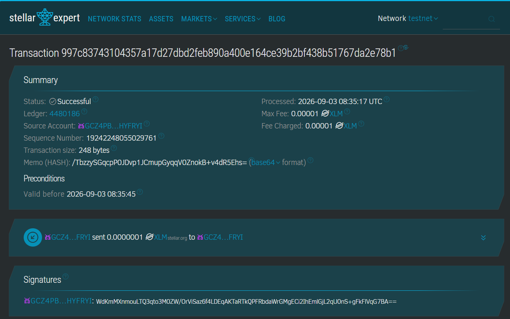

# Proof capture — Stage 4, item 4.4

PRD Goal G5: "Produce a tamper-evident public record of every alert." Measured
by: "Alert hash visible on Stellar Expert, matches locally recomputed hash."

## The anchored transaction

- Tx hash: `997c83743104357a17d27dbd2feb890a400e164ce39b2bf438b51767da2e78b1`
- Live on Stellar Expert: https://stellar.expert/explorer/testnet/tx/997c83743104357a17d27dbd2feb890a400e164ce39b2bf438b51767da2e78b1
- Anchors the hash of the genuine alert captured in `apps/pwa/public/alert-bundle.json`
  — the same hash `packages/hub` computed and returned as `alertHash` when that
  packet was accepted (see `packages/stellar/README.md` for how it was produced).

## What was independently re-verified for this capture (2026-09-10)

Rather than trusting `packages/stellar/README.md`'s existing claim as-is, this
was re-checked from scratch:

1. Loaded the transaction page above directly — still `Status: Successful`,
   ledger `4480186`, processed `2026-09-03 08:35:17 UTC`. Testnet has not
   reset since this was anchored.
2. Read the `Memo (HASH)` field as displayed: `/TbzzySGqcpP0JDvp1JCmupGyqqV0ZnokB+v4dR5Ehs=`
   (base64, as Stellar Expert shows it).
3. Decoded that value to hex: `fd36f3cf2486a9ca4fd090efa752429aea46caaa95d199e8901fafe1d479121b`.
4. That matches, byte for byte, the alert hash `packages/stellar/README.md`
   claims was anchored, and the hash `packages/hub` itself computed for that
   packet.

This satisfies PRD Goal G5 end to end: the hash is visible on Stellar Expert,
and it matches the locally recomputed hash — not asserted, independently
redone.

## What this does not prove

Same caveat as the rest of the repo's Stage 3/4 proof: this shows the
anchoring mechanism works correctly, not that a real alert from real field
hardware produced this hash. The sensor → mesh → hub chain that produces an
alert hash in the first place is proven separately, in `packages/mesh-sim`.
